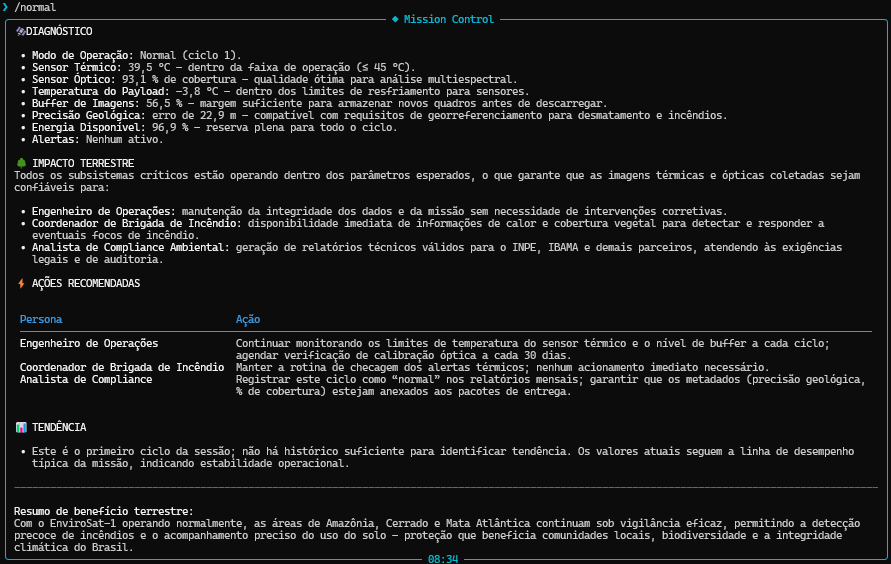
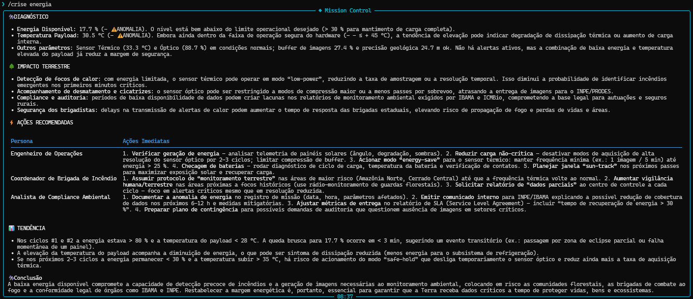

# 🚀 Mission Control AI - EnviroSat + ATLAS

## Integrantes
- Caio Marinho Pereira — RM: 572873 — Turma: 1CCPH

## O que o projeto faz
O sistema consiste em um satélite que recebe dados ambientais, especialmente temperatura, e tira fotos de tal área, e uma Inteligência Artificial que, com esses dados, analisa as condições, atribui um nível de severidade para a situação e propõe ações.

## Persona atendida
As personas mais atendidas são:
* Engenheiro
* Coordenador de brigada de incêndio
* Analistas de compliance ambiental

## 💼 Proposta de valor/modelo de negócio

A missão resolve, principalmente, o problema de incêndios ambientais, que afeta diversos setores, como agronegócio, construção civil,  saúde pública e meio ambiete. A solução pode ser fruto de uma parceria público-privada, entre empresas privadas e órgãos governamentais como INPE ou IBAMA. O sistema usa como métrica a quantidade de hectares atingidos pelo fogo. O modelo de negócio se baseia na ideia de concessão, em que a empresa é designada pelo Estado para cuidar do problema.

## Tecnologias utilizadas
* Python 3.10+
* Ollama Cloud API (modelo gpt-oss:120b)
* Bibliotecas: ollama, python-dotenv, Rich, PyFiglet, random, datetime, pathlib

## Como executar
1. Clone o repositório
2. Entre no repositório: `cd MISSION_CONTROL_AI`
3. Crie o ambiente virtual:  
   Linux: `python -m venv .venv && source .venv/bin/active`  
   Windows CMD: `python -m venv .venv && .venv\Scripts\activate.bat`
4. Intale as dependências: `pip install -r requirements.txt`
5. Crie arquivo `.env` na raiz com:  
   Linux e Windows CMD: `echo OLLAMA_API_KEY=sua_chave_aqui > .env`
6. Execute: `python main.py`

## Demonstração
Normal:   
Alerta: 

## System Prompt
[System Prompt](prompts/system_prompt.md)

## Cenários de testes demonstrados
1. Operação normal — todos os parâmetros dentro do range
2. Temperatura crítica — alerta + análise de IA
3. Baixa energia — resposta automatizada
4. Precisão geológica — alerta + resposta automatizada

## Limitações conhecidas
Fisicamente, sistema não considera perda de comunicação com a central e não especifica os possíveis danos a blindagem do satélite.  
Quanto ao software, a telemetria é completamente "fake", não há conexão com nada real (como APIs meteorológicas ou integração com INPE, IBAMA etc), e é totalmente dependente do Ollama Cloud.

## Vídeo de demonstração
🎥 [Assistir no YouTube](https://www.youtube.com/watch?v= Futuro link aqui)
